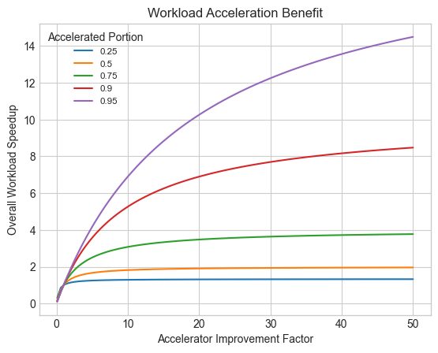

# Estimating Performance

## Amdahls Law

Amdahl's Law is a principle in computer architecture and parallel computing that governs the potential speedup of parallelizable tasks. It was formulated by computer architect Gene Amdahl in 1967.

The essence of Amdahl's Law revolves around the concept that not all parts of a program can be parallelized. Even in programs designed to run in parallel, there are often sequential portions that cannot be split into concurrent tasks. Amdahl's Law quantifies the maximum possible speedup that can be achieved by parallelizing a computation.

Mathematically, Amdahl's Law is expressed as follows:

$$\text{Speedup} = \frac{1}{(1 - P) + \frac{P}{N}}$$

Where:

- $\text{Speedup}$ is the improvement in performance achieved by executing a task in parallel compared to executing it serially.
- $P$ is the proportion of the computation that can be parallelized.
- $N$ is the number of processing units or cores available.

From this formula, we can derive several important insights:

1. As $N$ increases, the speedup approaches a maximum limit, which is $1/(1 - P)$. This limit indicates the theoretical maximum speedup achievable by parallelizing a computation.
2. Amdahl's Law highlights that even if a small portion of a program cannot be parallelized (even as $P$ approaches 0), the potential speedup is limited.
3. The effectiveness of parallelization is heavily influenced by the portion of the computation that can be parallelized ($P$). If $P$ is small, the potential speedup will be limited regardless of the number of processing units.

Amdahl's Law is crucial for understanding the trade-offs involved in parallel computing. It underscores the importance of identifying and optimizing parallelizable portions of algorithms to achieve significant performance improvements. Additionally, it emphasizes the diminishing returns of adding more processing units once the parallelizable portion has been fully exploited.

## Upper Bound of Accelerator Performance Benefit

Amdahl's Law can be used to estimate the upper bound performance benefit of a workload accelerator when applied to a portion of a workload. In this case:

- $\text{Speedup}$ is the improvement in performance achieved by using an accelerator to speedup a portion of the workload.
- $P$ is the proportion of the workload that can be accelerated.
- $\frac{P}{N}$ is the accelerator improvement factor which is the throughput of the accelerated portion using the accelerator vs using a general purpose CPU to process the accelerated portion.

The upper bound performance benefit of the accelerator is then the maximum limit, which is $1/(1-P)$.

The benefit of an accelerator is clearly larger for larger values of $P$. The chart below plots the maximum bebefit for various values of $P$ and $\frac{P}{N}$.

The above chart illustrates an interesting point. Often there is an assumption that using an accelerator will give "10x" improvement, but this is only true when the portion of the workload to which the accelerator can be applied is greater than 90%.

## Accelerator Real World Performance Benefit

In reality, the maximum theoretical performance benefit of an accelerator is difficult to achieve. There is usually a setup cost associated with using an accelerator. This could be preparing and sending descriptors to a PCIe attached accelerator or a GPU or preparing registers when using a co-processor or specialized CPU instructions. This setup cost can be viewed as increasing the non-acceleratable (or serialized) portion of the workload which essentially slightly reduces the proportion of the workload that can be accelerated.

## Estimating The Accelerated Portion of Workload

As illustrated above, the benefit of an accelerator depends upon the portion of the workload that can be accelerated (or parallelized using Amdahl's terminology). This portion is best determined by profiling the workload or aapplication and using the profiling data to measure the hotspots or the portion of the workload to be accelerated.
