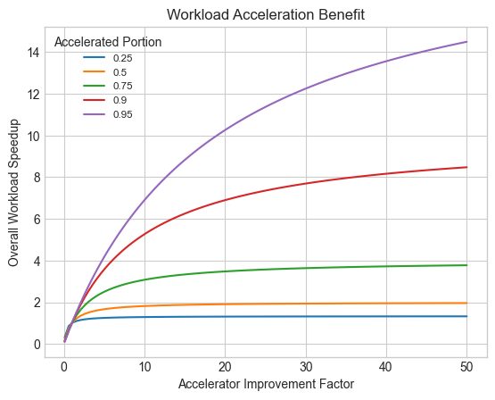

# Estimating Performance

## Amdahls Law

Amdahl's Law helps us answer a critical question in parallel computing: If we
add more processors, how much faster will our task actually get? The law states
that our total speedup is ultimately limited by the parts of our task that must
run sequentially, one step at a time.

We can calculate the potential speedup with the following formula:

\\[\text{Speedup} = \frac{1}{(1 - P) + \frac{P}{N}}\\]

Let's break down the variables:

- \\(P\\): The proportion of the task that can be split up and run in parallel.
  For example, if 90% of your application can be parallelized, \\(P\\) is 0.9.
- \\(N\\): The number of processing units you have to work with.

From this formula, we can derive several important insights:

1. As \\(N\\) increases, the speedup approaches a maximum limit, which is
   \\(1/(1 - P\\). This limit indicates the theoretical maximum speedup
   achievable by parallelizing a computation.
2. The effectiveness of parallelization is heavily influenced by the portion of
   the computation that can be parallelized (\\(P\\)). If \\(P\\) is small, the
   potential speedup will be limited regardless of the number of processing
   units.

Amdahl's Law is crucial for understanding the trade-offs involved in parallel
computing. It underscores the importance of identifying and optimizing
parallelizable portions of algorithms to help achieve significant performance
improvements. Additionally, it emphasizes the diminishing returns of adding more
processing units once the parallelizable portion has been fully exploited.

## Upper Bound of Accelerator Performance Benefit

Amdahl's Law can be used to estimate the upper bound performance benefit of a
workload accelerator when applied to a portion of a workload. In this case:

- \\(\text{Speedup}\\) is the improvement in performance achieved by using an
  accelerator to speedup a portion of the workload.
- \\(P\\) is the proportion of the workload that can be accelerated.
- \\(N\\) is the accelerator improvement factor which is the relative
  performance of the accelerator vs using a general purpose CPU to process the
  accelerated portion only. As an example, if a cryptographic accelerator can
  implement an algorithm with a performance of 50x compared to a CPU core,
  then \\(N=50\\).

The upper bound performance benefit of the accelerator is then the maximum
limit, which is \\(1/(1-P)\\).

The benefit of an accelerator is clearly larger for larger values of \\(P\\).
The chart below plots the maximum benefit for various values of \\(P\\) and
\\(N\\).

The above chart illustrates an interesting point. Often there is an assumption
that using an accelerator will give "10x" improvement to an overall workload,
but this is only true when the portion of the workload to which the accelerator
can be applied is greater than 90%.

## Accelerator Real World Performance Benefit

In reality, the maximum theoretical performance benefit of an accelerator is
difficult to achieve. There is usually a setup cost associated with using an
accelerator. For example, preparing and sending descriptors to a PCIe attached
accelerator or a GPU or preparing registers when using a co-processor or
specialized CPU instructions. This setup cost can be viewed as increasing the
non-acceleratable (or serialized) portion of the workload which slightly reduces
the proportion of the workload that can be accelerated.

## Estimating The Accelerated Portion of Workload

As illustrated above, the benefit of an accelerator depends upon the portion of
the workload that can be accelerated (or parallelized using Amdahl's
terminology). This portion is best determined by profiling the workload or
application and using the profiling data to measure the hot-spots or the portion
of the workload to be accelerated.
